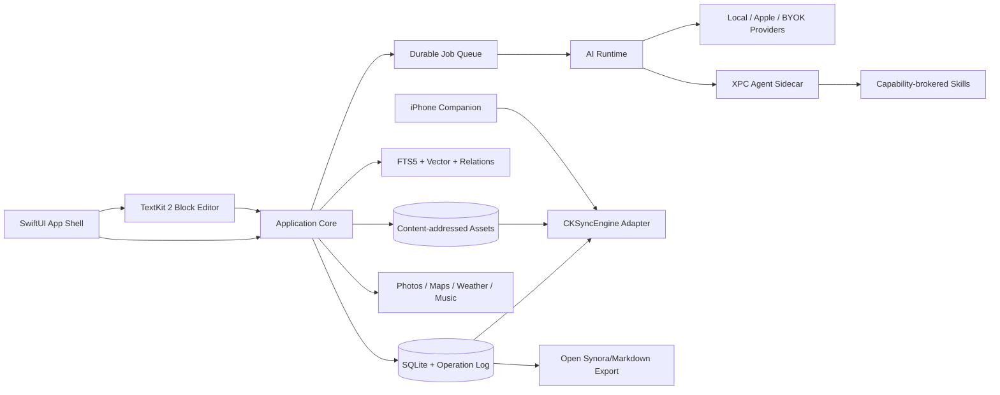

# Synora Wiki 产品技术规格与技术选型

文档版本：1.1
状态：CONFIRMED（约定的目标架构；尚无原生实现，探针与 availability 未验证）
对应产品版本：完整个人版
原则：原生 Mac、本地优先、开放可迁移、AI 可替换、任何写入可审计

## 1. 技术目标

1. 正文编辑永远不依赖网络、模型或同步服务。
2. 长文与多媒体稳定，编辑路径保持 60 fps，不因 AI 作业阻塞。
3. 用户原文、原始来源、模型派生知识和索引缓存分层。
4. AI、同步、Skills 都在可取消、可恢复、可观测的任务边界内运行。
5. 数据可通过开放格式完整导出，并从导出物重建索引和关系。
6. UI 严格以 `DESIGN.md` 和高保真原型为视觉合同。

## 2. 平台与兼容策略

- 主应用：macOS 原生，Apple Silicon 优先；部署基线建议 macOS 15。
- 新系统能力：使用编译期与运行时 availability 检查渐进启用，不能提高基础记录和检索的门槛。
- iPhone 伴侣：只承担快捷采集、分享扩展、HealthKit 授权摘要与同步，不复制完整 Mac 编辑器。
- 发布：首选签名、Hardened Runtime 与 App Sandbox 的 `.app`；开源构建同时支持 Swift Package/Xcode 本地运行。

最终最低系统版本须在 Phase 0 用真实设备矩阵验证后写入 ADR-001。任何依赖最新系统的增强能力都必须有功能等价或明确的降级路径。

## 3. 总体架构



架构采用单向依赖：界面依赖 Application Core，Core 依赖协议而非具体存储、模型或云服务。UI 不直接调用供应商 API、CloudKit 或文件系统。保存、选区、停笔和查询由 Core 分派到现有用例；确定性任务直接执行，模型任务进入统一队列与权限链，不为每项功能建立独立 Agent。XPC 只承担隔离，不限定交互入口。

## 4. 技术选型

| 领域 | 选择 | 原因 | 不选/限制 |
|---|---|---|---|
| UI | Swift 6 + SwiftUI | 原生菜单、窗口、拖放、可访问性和系统集成 | 不用 Electron/Tauri 作为正式壳；Web 原型仅是视觉合同 |
| 桌面布局 | `NavigationSplitView` + SwiftUI `inspector`，必要处窄 AppKit bridge | 与四栏、恢复和系统行为匹配 | 不用自绘窗口管理器 |
| 编辑器 | TextKit 2 / `NSTextView` 经 `NSViewRepresentable` 封装 | 长文、IME、附件、选区、撤销和可访问性成熟 | 不用纯 SwiftUI `TextEditor` 承担结构化富文本；不嵌 Web 编辑器 |
| 结构模型 | 稳定 UUID block tree + attributed text adapter | 块级引用、同步、diff 与媒体布局可控 | 不把 Markdown 文本解析结果当唯一运行态 |
| 本地数据库 | SQLite WAL + GRDB.swift | 事务、迁移、FTS5、可测试、无服务进程 | 不以 SwiftData 自动 CloudKit 作为主同步，因唯一约束、关系与冲突控制受限 |
| 操作历史 | append-only operation log + 周期快照 | 崩溃恢复、同步合并、审计、撤销和重放统一 | 不只保存最终文档 blob |
| 附件 | SHA-256 内容寻址文件仓 + 派生缩略图 | 去重、校验、同步与导出明确 | 不把大二进制直接塞入正文或日志 |
| 同步 | CloudKit private database + custom zones + `CKSyncEngine` | 保留本地权威与冲突控制，系统负责调度 | 不把“同步完成”作为保存完成；不依赖 iCloud Drive 对包内容的隐式合并 |
| 全文搜索 | SQLite FTS5 + BM25 | 快、稳定、离线 | 不用远端搜索服务 |
| 语义搜索 | embedding store + Accelerate 精确余弦；达到阈值后切 HNSW | 小库保持正确简单，大库保持性能 | ANN 切换必须与精确搜索做召回率回归 |
| 关系索引 | SQLite adjacency + typed relation tables | 先服务关联、查询和 lint | 当前不实现图谱 UI |
| AI 接口 | 自有 `LanguageModelProvider` 协议 + `URLSession` 客户端 | BYOK 可替换，避免业务层锁定 SDK | 不在领域层硬编码模型名或单一供应商 |
| Apple AI | Foundation Models adapter（有可用性检查） | 本地/系统模型适合摘要、提取和改写 | 设备/地区/模型不可用时自动切换或排队 |
| 云 AI | OpenAI Responses、Anthropic Messages、Gemini、OpenAI-compatible adapters | 覆盖深度推理、结构输出与本地服务 | 每个 adapter 有契约测试和 capability matrix |
| 后台任务 | durable SQLite job queue + Swift structured concurrency | 可恢复、取消、幂等、有限并发 | 不用脱离持久状态的裸 `Task.detached` |
| Agent sidecar | XPC Service | 与编辑器隔离生命周期和崩溃边界 | Sidecar 无权直接改数据库 |
| 可执行 Skills | manifest + WASI sandbox（Wasmtime）+ capability broker | 可限制文件、网络、工具和写入 | Prompt-only Skills 不需 WASM；任意 shell 默认禁用 |
| 密钥 | Keychain Services | 系统加密存储与访问控制 | 密钥不进入 UserDefaults、SQLite、日志或导出 |
| 测试 | Swift Testing/XCTest、XCUITest、SnapshotTesting、契约/故障注入 | 覆盖核心、UI、供应商、同步与恢复 | 视觉验收不能只靠人工 |
| 日志 | `Logger`/OSLog + 隐私标记 + 本地诊断导出 | 原生、低开销、可脱敏 | 默认不记录正文、完整提示词或密钥 |

依赖版本使用 Swift Package Manager 锁定在 `Package.resolved`。每季度或在系统大版本发布后做依赖升级批次，不在功能开发中隐式漂移。

## 5. 模块边界

```text
SynoraWiki/
├── App/
│   ├── SynoraWikiApp.swift
│   ├── AppCommands.swift
│   └── AppEnvironment.swift
├── Features/
│   ├── Shell/
│   ├── LibraryNavigation/
│   ├── RecordList/
│   ├── Editor/
│   ├── Journal/
│   ├── Search/
│   ├── InboxReview/
│   ├── AIAssistant/
│   ├── Skills/
│   ├── Settings/
│   └── KnowledgeGraph/        # 数据契约先行，UI 在独立设计后启用
├── Packages/
│   ├── SynoraDomain/          # 实体、值对象、业务规则
│   ├── SynoraApplication/     # use cases、commands、queries
│   ├── SynoraEditorKit/       # TextKit 2、block tree、undo、inline AI
│   ├── SynoraStore/           # GRDB、迁移、operation log、snapshots
│   ├── SynoraAssets/          # 内容寻址、缩略图、Quick Look
│   ├── SynoraSearch/          # FTS、embedding、relation index
│   ├── SynoraWikiEngine/      # ingest/query/lint、schema migration
│   ├── SynoraAIRuntime/       # routing、proposals、provider protocols
│   ├── SynoraSync/            # CKSyncEngine、merge、tombstones
│   ├── SynoraSkillRuntime/    # manifest、permissions、WASI bridge
│   ├── SynoraIntegrations/    # Photos/Maps/Weather/Music
│   └── SynoraObservability/   # logs、metrics、diagnostics
├── Services/
│   └── SynoraAgentService/    # XPC sidecar target
├── Companion/
│   ├── SynoraCapture/         # iPhone app target
│   ├── ShareExtension/
│   └── HealthSummary/
├── Resources/
│   ├── Assets.xcassets
│   ├── Localizable.xcstrings
│   └── DefaultRules/
├── Tests/
│   ├── Unit/
│   ├── Integration/
│   ├── Contract/
│   ├── Performance/
│   ├── Snapshot/
│   └── UITests/
├── UITestFixtures/
└── docs/
    ├── adr/
    ├── schemas/
    └── threat-model/
```

Feature 层只组合 Use Case 与 ViewModel；所有可复用逻辑在 Package 中。每个 Package 有自己的测试 target，禁止形成 `App` 巨型模块。

## 6. 领域数据模型

### 6.1 核心实体

| 实体 | 关键字段 | 说明 |
|---|---|---|
| `Library` | id, title, rulesVersion, syncZone | 一个个人知识库 |
| `Record` | id, kind, title, createdAt, journalDate, revision, deletedAt | 笔记/手帐统一外壳 |
| `Block` | id, recordID, parentID, type, orderKey, content, attributes, revision | 稳定块节点 |
| `Asset` | id/hash, mediaType, byteSize, localState, syncState | 原件内容寻址 |
| `AssetPlacement` | blockID, assetID, crop, caption, order | 媒体显示与原件分离 |
| `Source` | id, kind, uri, capturedAt, contentHash, immutablePayloadRef | 原始来源不可变 |
| `WikiPage` | id, slug, title, body, rulesVersion, derivedRevision | 模型维护知识页 |
| `Citation` | ownerID, sourceID/blockID, span, quoteHash | 块级追溯 |
| `Relation` | fromID, toID, type, confidence, provenance | 关联、实体、主题 |
| `RuleSet` | id, semanticVersion, purpose, schema, policy, hash | 知识库规则版本 |
| `ChangeSet` | id, author, risk, operations, beforeHash, afterHash | 用户/AI 写入事务 |
| `Operation` | id, deviceID, lamport, entityID, payload, hash | append-only 事件 |
| `AIJob` | id, kind, state, inputHash, routing, attempts, checkpoint | 可恢复作业 |
| `ModelProfile` | id, provider, modelAlias, capability, policy | 不含密钥 |
| `SkillInstall` | id, packageHash, version, manifest, state | 安装状态 |
| `PermissionGrant` | subject, capability, scope, expiresAt | Skills/集成权限 |

所有实体 ID 使用客户端生成的 UUIDv7 或等价的时间可排序 UUID；数据库唯一性在本地事务中执行，CloudKit record name 复用实体 ID 以保证幂等。

### 6.2 用户内容与模型内容边界

- 用户原文块的 `author = user`。AI 不能在后台直接更新这些块。
- 行内 AI 被接受后生成用户可撤销的 `ChangeSet`，仍保留建议 provenance。
- 原始来源 payload 写入后不可变；修正通过新版本或新来源表达。
- WikiPage、摘要、embedding、OCR、实体和关系均为派生数据，可从来源重建。
- 手工编辑知识页会创建 `humanOverride` 区域，后续 ingest 不可覆盖，只能提案合并。

## 7. Synora 开放库格式

“库格式”用于全量导出、备份和可读镜像；运行时以 SQLite+附件仓为事务源，以操作日志为历史源。

```text
My Library.synora/
├── manifest.json
├── records/
│   └── <record-id>/
│       ├── record.json
│       └── content.md
├── raw/
│   └── <source-id>/
│       ├── metadata.json
│       └── payload.*
├── wiki/
│   └── <slug>.md
├── rules/
│   ├── purpose.md
│   ├── schema.yaml
│   └── policy.yaml
├── system/
│   ├── index.md
│   └── log.jsonl
├── assets/
│   └── sha256/<prefix>/<hash>
└── checksums.sha256
```

Markdown 使用稳定的 YAML front matter 和块 ID 注释保证往返；未知字段在导入导出时保留。`checksums.sha256` 覆盖全部内容，恢复前必须校验。

## 8. 编辑器架构

### 8.1 分层

1. `BlockDocument`：与 UI 无关的块树和值对象。
2. `TextStorageAdapter`：把可连续编辑的文本映射到 block ranges。
3. `SynoraTextView`：TextKit 2 布局、选区、输入法、查找和辅助功能。
4. `AttachmentCoordinator`：异步缩略图、视频/音频/PDF 展示与占位尺寸。
5. `EditorCommandBus`：所有编辑命令转换为可撤销 `ChangeSet`。
6. `InlineSuggestionController`：维护 ghost text，不直接进入 TextStorage。

### 8.2 一致性规则

- 每次编辑先写本地事务，再异步触发索引、AI 和同步。
- UI diff 基于稳定 Block ID，不用字符串位置作为跨设备标识。
- 输入法 marked text 阶段不拆块、不触发 AI、不自动格式化。
- 媒体导入采用 staging → hash → 原子移动；失败不创建悬空 placement。
- 版本历史按 operation log 重放，并通过周期 snapshot 控制恢复时间。

## 9. LLM Wiki 引擎

### 9.1 三层结构

- `raw`：原始来源和用户记录引用，只增量追加或显式删除。
- `wiki`：LLM 维护的综合知识页，面向阅读与查询。
- `rules`：用户和模型共同演进的 purpose/schema/policy，版本化并驱动 ingest/lint。

实现遵循“先保存来源，再维护知识”的顺序，不用每次问答临时把所有原文塞入上下文。`index` 由已提交页面元数据确定性生成，`log` 从操作事件投影；语义摘要由模型生成并受来源版本约束，模型不重写聚合目录或历史日志。

### 9.2 ingest pipeline

```text
capture → normalize → chunk → extract → retrieve candidates
→ propose page/link changes → validate citations/schema
→ apply by risk policy → reindex → append log
```

- 每一步按来源 UUID/记录 ID、输入 revision/hash、rulesVersion 和阶段版本建立幂等键；阶段版本覆盖相关 parser/prompt/model 配置。只失效受变更影响的阶段及其下游，不全库重跑。
- 缓存命中须校验产物存在、hash 与版本匹配；缺失/损坏进入修复，显式删除的产物遵守 tombstone，不因缓存修复复活。解析器、模型和提示词版本写入 provenance。
- parser/chunker 输出正文、标题路径、页码或块定位、表格/代码边界与解析告警；解析不完整不能标记完整成功。保留原件，模型摘要不能替代精确来源。
- 大任务按稳定分块建立检查点；崩溃后从最近成功阶段恢复。解析和模型准备有限并发，提交按库协调；短事务内重验 revision/权限及作业世代，冲突重新提案，取消或失败释放提交顺序，丢弃迟到结果。
- 合并或改名不直接删除旧 slug，保留 alias 与历史引用。

### 9.3 query pipeline

1. 解析时间、实体、媒体和来源过滤器；先应用库与对象权限。
2. 知识页用于综合召回，原文索引用于精确事实与最新记录；并行执行可用的 FTS、向量与关系候选检索，不以模型整理完成为原文可查条件。
3. 混合排序，保留得分组成；关系扩展限制跳数和候选数，并再次应用权限/时间过滤。算法候选见 U-009。
4. 在统一上下文预算内读取最小必要证据块，生成带 citation ID 的回答；证据不足才扩大检索，达到预算仍不足则说明未知，不默认遍历全库。
5. 对引用做存在性、revision 与 quote hash 校验；过期摘要回查原文。纯查找可直接返回命中记录，无需生成式调用。

### 9.4 lint pipeline

固定检查包含断链、无引用事实、重复页、孤立页、schema 违规、过期摘要、互相矛盾的当前事实、无效 alias 与失败作业。存在性、schema、链接和版本检查由确定性代码执行；语义重复、矛盾与过期判断使用模型。变更后只检查受影响对象及邻接关系，周期全量检查查漏。修复按风险进入提案；拒绝项仅在证据或规则版本变化后重新评估。

来源移动/改名不改变 UUID。来源删除按 Citation/Relation 定位受影响知识并标记证据失效，不按文件名或子串级联删页；保留其他来源、humanOverride 与历史，修复走同一 Proposal/ChangeSet 链。恢复后重新验证引用，不复活已被用户删除的其他对象。

## 10. 搜索与索引

- FTS5 索引标题、正文、OCR、转写、来源和知识页，按字段配置 BM25 权重。
- 中文分词采用 tokenizer abstraction；Phase 3 对系统 tokenizer、Jieba 兼容实现与 trigram 回退做真实语料评测后锁定。
- embedding 分块与编辑块边界一致，包含 `contentHash/modelID/dimensions`，模型切换可并行重建。
- 小于 50,000 chunks 时用 Accelerate 精确向量检索；超过阈值且 P95 不达标时启用 HNSW。切换阈值由基准测试决定，不是产品能力开关。
- 关系索引保留 relation type、来源、置信度和生效时间，为未来图谱服务。

## 11. AI Runtime

### 11.1 Provider 协议

```swift
protocol LanguageModelProvider: Sendable {
    var capabilities: ModelCapabilities { get }
    func stream(_ request: ModelRequest) -> AsyncThrowingStream<ModelEvent, Error>
    func embed(_ request: EmbeddingRequest) async throws -> EmbeddingBatch
    func countTokens(_ request: ModelRequest) async throws -> TokenEstimate
}
```

`ModelRequest` 只包含规范化消息、结构化输出 schema、允许工具、预算、隐私等级和取消句柄。供应商 adapter 负责把它翻译为具体 API。

### 11.2 路由

- `lightweight`：分类、标签、摘要、实体、链接候选；优先本地/低延迟模型。
- `inline`：续写/改写；要求低首 token 延迟与可取消流。
- `reasoning`：复杂问答、规则迁移和跨页综合；可用用户选择的强模型。
- `embedding`、`vision`、`transcription` 分别独立配置。

路由先检查任务所需能力、隐私策略、联网状态、预算和模型健康，再按用户优先级选择；不在代码中用供应商名称判断业务。

连续编辑按记录合并待处理事件，只处理变化块及依赖；索引、格式规则和结构 lint 不调用模型。提取结果供摘要、标签、关联复用，复杂或校验失败任务才在预算内升级模型。输入法组合/连续输入不发起建议；选区或 revision 变化取消旧建议，拒绝后按规则冷却，不以停笔事件无限重试。

上下文统一计入工具声明、规则、历史、检索块、工具结果与回答预留；adapter 使用 token 计数或标明误差的保守估算，不把字符数视为 token 数。超限先缩小上下文而非截断引用。稳定规则前缀可使用供应商支持的 prompt cache，缓存按版本与权限失效；不预设命中率或节省比例。诊断记录任务类别、调用次数、输入/输出/缓存用量与费用估计，不记录正文。

### 11.3 结构化写入

- 所有知识修改都由模型输出 JSON Schema 对应的 `Proposal`，禁止让自由文本直接变成数据库命令。
- Proposal 经 deterministic validator 校验目标存在、revision、引用、权限和风险。
- `ChangeSetApplier` 在单事务中应用，并把反向操作写入 undo/history。
- 工具调用有 allowlist、最大总调用数、最大并发、超时、输出尺寸和数据外发策略。

### 11.4 BYOK

- Keychain item key：`providerID/profileID`；数据库只保存 opaque reference。
- 设置页提供连接测试、模型发现、capability matrix、预算、代理和删除密钥。
- 日志对 Authorization、query、正文片段和供应商错误体做脱敏。
- 支持用户自定义 OpenAI-compatible base URL；默认拒绝非 HTTPS，loopback 本地服务例外。

## 12. Agent sidecar 与 Skills

### 12.1 权限架构

XPC Agent 只获取一次任务的最小上下文；它通过 capability broker 调用 `search`, `readBlocks`, `proposeChanges`, `export`, `photos`, `network` 等工具。只有主应用能提交 `ChangeSet`。

个人画像复用 WikiPage、Relation、Citation 和 RuleSet，不另建独立记忆库。区分用户明确事实/偏好与模型推测，附来源 revision、有效时间及确认状态；显式纠正优先于推测，历史偏好保留时间边界。来源撤回/删除使相关画像及缓存失效；画像自身的删除通过 tombstone/规则抑制重建，停用后不进入上下文。跨设备和导出复用现有知识页/规则链。

### 12.2 Skill 包

```text
my-skill.synoraskill/
├── manifest.json
├── SKILL.md
├── resources/
└── module.wasm          # 可选；纯提示/流程 Skill 无此文件
```

`manifest.json` 至少包含 ID、版本、最低 runtime、入口、权限、网络域名白名单、工具声明、包哈希与签名。安装顺序为：解包到 staging → 防路径穿越 → hash/signature → schema/compatibility → 权限预览 → 原子激活。

### 12.3 隔离

- Prompt-only Skill 只影响任务指令与工具列表，不获得任意代码执行。
- 可执行 Skill 在 WASI 沙箱运行；无继承环境变量、无默认网络/文件系统。
- 文件访问通过 security-scoped bookmark 与虚拟目录映射。
- 网络由 broker 发起并强制域名、方法、大小与超时策略。
- Skill 崩溃或超时只终止该任务；未提交事务自动回滚。

## 13. 同步设计

### 13.1 CloudKit 映射

- 每个 Library 使用 private custom zone。
- Record、Block、WikiPage、RuleSet、ChangeSet、Operation、AssetMetadata 映射为独立 CKRecord。
- 大附件使用 CKAsset；按阈值分片并以 SHA-256 校验。
- `CKSyncEngine` state 与 pending operation IDs 持久化到本地数据库。
- tombstone 有保留期，未在所有已知设备确认前不物理删除附件。

### 13.2 合并

- 不相交 Block 修改按 operation 顺序收敛。
- 同一 Block 的属性字段可按字段合并；正文重叠修改保留双方版本并生成 Conflict Review。
- 顺序使用可重编号的稠密 order key；并发插入按 Lamport+deviceID 决定稳定顺序。
- 规则、schema 与知识页合并一律生成提案，不用 last-write-wins 静默覆盖。
- 同步不决定本地保存成功；UI 只在需要用户干预时展示冲突。

### 13.3 iPhone 健康桥接

HealthSummary target 在 iPhone 上请求细粒度 HealthKit 权限，把用户选择的运动/步数/睡眠等摘要转换为普通、可删除的 `JournalFact`，通过同一 CloudKit zone 同步到 Mac。原始 HealthKit sample 不上传、不复制到 Synora 库；摘要带采样范围与来源说明。

## 14. Apple 平台集成

- Photos：`PhotosPicker`/PhotoKit，受限图库状态必须可用；原件按用户动作导入。
- Map：MapKit 搜索、地理编码和静态/交互地图；精确位置允许降级为城市。
- Weather：WeatherKit 获取写作时快照，保存 attribution、时间与位置精度。
- Music：MusicKit 获取授权元数据和最近播放候选，播放受 MusicKit 权限控制。
- 文件：FileImporter、拖放、Quick Look、PDFKit、AVKit/AVFoundation。
- 系统入口：Share Extension、Services、Spotlight metadata、App Intents；索引内容遵循每库隐私开关。

## 15. 安全与隐私

- App Sandbox + Hardened Runtime；XPC/Companion 采用最小 entitlement。
- API 密钥放 Keychain；库级加密密钥也只在 Keychain 保存。
- 可选库级加密：CryptoKit AES-GCM，独立 content key，备份时要求恢复密钥验证。
- 附件导入防止路径穿越、符号链接逃逸、超限压缩包和 MIME 欺骗。
- 远程 AI 调用默认只发送任务所需块；UI 显示发送范围、供应商与本地/远程状态。
- OSLog 使用 privacy 标记；诊断包默认只含计数、状态、错误码与散列 ID。
- Threat model 覆盖恶意文档 prompt injection、恶意 Skill、MCP 工具越权、模型输出注入和同步回放。

## 16. 可观测性与故障恢复

关键 signpost：launch、openRecord、saveTransaction、layoutPass、search、AI first-token、ingest stage、sync batch、asset import。作业状态机：`queued → running → waitingForNetwork/waitingForApproval → succeeded/failed/cancelled`。

- 每个作业保存 checkpoint、attempt、nextRetryAt 与结构化错误。
- 进程退出时不把 `running` 当失败；重启后通过 lease 超时恢复。
- 提供诊断页：库健康、索引版本、待同步数量、失败作业、最近备份与模型状态。
- 提供“重建派生数据”，但绝不要求用户删库解决问题。

## 17. 测试策略

测试分层与性能预算统一见 [TESTING.md](TESTING.md)。

## 18. 技术验收标准

技术门槛统一见 [ACCEPTANCE.md](ACCEPTANCE.md)。

## 19. 关键技术风险与缓解

| 风险 | 影响 | 缓解 |
|---|---|---|
| TextKit 2 与复杂块/附件互操作 | 编辑器稳定性 | 先做垂直技术探针；block model 与渲染解耦；高强度 IME/撤销测试 |
| CloudKit 异步与冲突 | 数据一致性 | operation log、custom zone、CKSyncEngine、冲突副本、故障注入 |
| 多供应商能力不一致 | AI 行为漂移 | capability matrix、统一 schema、契约测试、provider eval |
| 本地模型不可用 | AI 功能断档 | runtime availability 检查、BYOK fallback、持久任务队列 |
| Skill 供应链与越权 | 内容/隐私风险 | 签名、hash、WASI、capability broker、最小权限、审计 |
| 媒体与库体积增长 | 启动/同步压力 | content-addressing、缩略图、分片、按需下载、容量诊断 |
| schema 演进破坏知识页 | 长期维护 | versioned RuleSet、迁移提案、dry-run、可回滚快照 |

## 20. 参考资料

- [A.I.-generated “LLM Wiki” concept — Andrej Karpathy](https://gist.github.com/karpathy/442a6bf555914893e9891c11519de94f)
- [ADR-H002 方案细化](decisions/ADR-H002-agent-knowledge.md)：案例固定版本、采纳映射与实验边界；不照搬框架。
- [Apple SwiftData and CloudKit compatibility](https://developer.apple.com/documentation/swiftdata/syncing-model-data-across-a-persons-devices)
- [Apple CKSyncEngine](https://developer.apple.com/documentation/cloudkit/cksyncengine-4b4w9)
- [Apple: deciding whether CloudKit is right for an app](https://developer.apple.com/documentation/cloudkit/deciding-whether-cloudkit-is-right-for-your-app)
- [Apple Foundation Models](https://developer.apple.com/documentation/FoundationModels/)
- [Apple Keychain Services](https://developer.apple.com/documentation/security/keychain-services)
- [OpenAI Responses API](https://developers.openai.com/api/reference/cli/resources/responses/methods/create)：作为 OpenAI provider 的工具调用与结构化输出入口，不作为领域层耦合。
